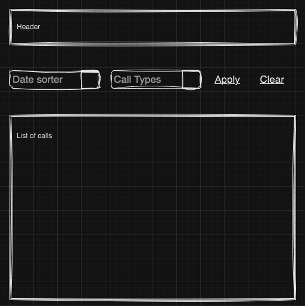

# 👨‍🎨 Assessment results

This pull request is divided into sections, following the tasks by the level of competencies suggested.

1. [Jr. SE contributions](#001)
2. [SE contributions](#002)
3. [Sr. SE contributions](#003)
4. [Staff SE contributions](#004)
5. [Additional improvements added](#005)

<a name="001"></a>
#### Jr. SE contributions

##### Call list page
###### Pagination

1. Import the ```useState``` React hook.
2. Initialize the ```callsPerPage``` variable following the ```useState``` hook convention.
3. Add a handler function to control when the user changes the page size and reflect the change in the UI by setting the value ```callsPerPage``` accordingly.
4. Provide the ```Pagination``` component with the proper props/values/handlers.


```javascript

/**
 * @component > CallsList
 * Extracts of the code implemented
 */

import { useState } from 'react';
// ...
const [callsPerPage, setCallsPerPage] = useState<number>(5);
// ...
const handleOnPageSizeChange = (newPageSize: number): void => {
  setCallsPerPage(newPageSize);
};
// ...
<Pagination
  {...otherProps}
  pageSize={callsPerPage}
  onPageSizeChange={handleOnPageSizeChange}
/>
//...
```

5. Demo


###### Filters

1. Add a filter component to allow filtering the list of calls.
2. The new UI component will consist of a form-like implementation provided with 
(From the design system components):
  - A select ```sort by date``` dropdown.
  - A select ```call types``` dropdown.
  - Link buttons to control either when filters are applied or cleared.

  

3. Add ````handler functions```` to control when the user applies/clears the filters, to emit/executes the callback operation(s) in the parent component.
4. Develop a ````custom hook```` to extract logic from the component. (Filters and maps operations).
4. Persist filters in the browser's address bar, so that we can paginate the list by keeping the filters, as follows:

````javascript
{__DOMAIN__}/calls/?filter=value&anotherFilter=anotherValue
````

5. As the new component is intended to work with the CallsList page strictly, it's a good practice to follow this architectural pattern (Screaming).

```md
├── src/
│   ├── components/
│   │   └── ...
│   └── pages/
│       ├── CallsList/
│       │   ├── components/
│       │   │   └── CallsListFilters.tsx
│       │   ├── hooks/
│       │   │   └── useCallLis.tsx
│       │   └── types/
│       │   │   └── CallsList.d.ts
│       │   ├── CallsList.tsx
│       └── anotherPage/
│           ├── ...
```

6. Demo


###### Group calls

1. Add a custom hook function to map and group the call entries by date.
2. Import the custom hook function into the CallsList page and map the result set whenever a new response payload is received.

> Noticed the calls are grouped by the day they occurred. **i.e.: Apr 4**


<a name="002"></a>
#### SE contributions

###### Logout feature
###### Expiration token UX
###### Unit tests

The tool used to perform unit tests is **Jest**.

Added several unit tests:
- `dates.spec.ts` (Helper functions).
- `useCallList.spec.ts` (Custom utils hook).
- `CallsListFilters.spec.tsx` (Component).

Output after running `yarn test`:


<a name="003"></a>
#### Sr. SE contributions

###### E2E test (Cypress)

The tool selected to perform E2E tests is **Cypress**.

**1. Scripts:**

These scripts were added to the project.

```shell
# Open Cypress config wizard, and its tool to monitor/execute/perform/etc. E2E tests
> yarn cy:open

# Execute only the E2E tests within the terminal window, (Make sure the project is running in parallel).
> yarn cy:run

# Starts the application and executes the E2E tests at the terminal level (In-parallel)
> yarn cy:test

# Starts the application and executes the Cypress tool (In-parallel)
> yarn cy:e2e
```

**2. Environment variables:**

To ease the E2E testing, we can provide the Cypress runner with some variables. We only need to **create a .env.e2e file at the project's root level**, and fill in the variables accordingly.

| Env. variable      | Value                                |
| ------------------ | ------------------------------------ |
| APP_BASE_URL       | `http://localhost:3000` or another   |
| AUTH_TOKEN_KEY     | <YOUR_AUTH_TOKEN_KEY>                |
| REFRESH_TOKEN_KEY  | <YOUR_REFRESH_TOKEN_KEY>             |

Then, we need to load them all using `dotenv`, as follows:

```javascript
/**
 * @file
 * cypress.config.ts
 */

import { defineConfig } from "cypress";
import dotenv from 'dotenv';

const env_e2e = dotenv.config({ path: '.env.e2e' }).parsed; // <--- Load environment variables here

export default defineConfig({
  e2e: {
    setupNodeEvents(on, config) {
      config.env = {
        ...config.env,
        ...env_e2e, // <--- Passing environment variables to the configs here
    };

    return config;
    },
  },
});
```
Finally, we can use the variables within any spec file, as follows:

```javascript
/**
 * @file
 * WhateverTest.cy.ts
 */

describe('Whatever test spec', () => {
  it('Whatever test', () => {
    const appBaseURL = Cypress.env('APP_BASE_URL') // <--- Example on how to use an environment variable (i.e.: At test level).
    // ...
  });
});
```

**3. Fixtures**

We can use these files to set dummy data across our tests.

```javascript
/**
 * @file
 * <rootDir>/cypress/fixtures/examples.json
 * 1. Defining our dummy data...
 */

{
  "login": {
    "username": "hello@cypress.io",
    "password": "12345"
  }
}

/**
 * @file
 * Whatever.cy.ts
 * 2. Use it in any spec test...
 */

import fixtures from '../fixtures/example.json';
//..
```


**4. Demo**

4.1. `yarn cy:run` command output.


4.2. Cypress E2E tets in action.


###### Archive call feature
...
###### Sync tabs after archiving a call (Real-time support)
...

<a name="004"></a>
#### Staff SE contributions

###### Release plan
...

<a name="005"></a>
#### Additional improvements added
...
